# Mermaid 图表模板参考

本文档提供各种架构模式和数据流场景的 Mermaid 图表模板。

**强制要求：实际输出分析文档时，每个 Mermaid 图表后都必须补一份语义一致的 ASCII/TUI 预览图，供终端和评审场景直接审查。**

## 目录

1. [架构图模板](#架构图模板)
2. [时序图模板](#时序图模板)
3. [数据流图模板](#数据流图模板)
4. [类图模板](#类图模板)

---

## 架构图模板

### 分层架构（经典三层/多层）

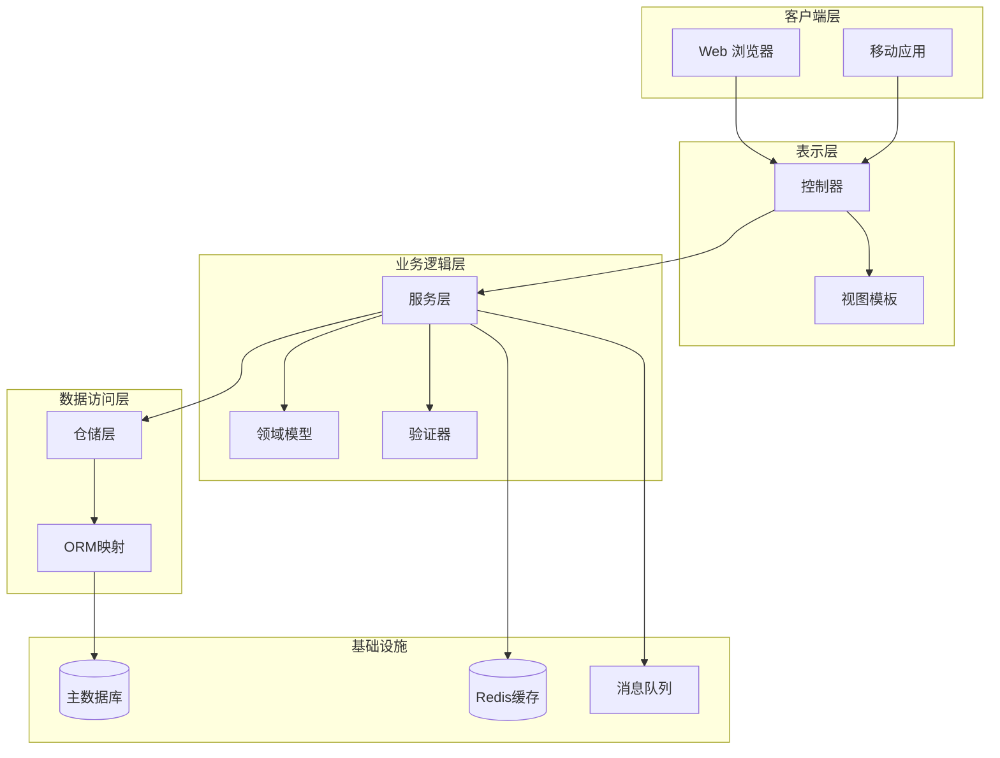

### 微服务架构

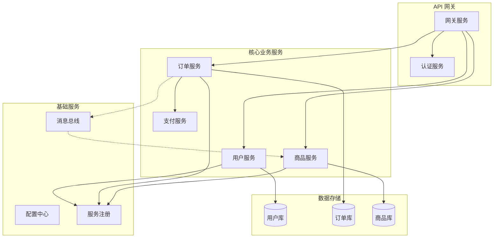

### 前后端分离架构

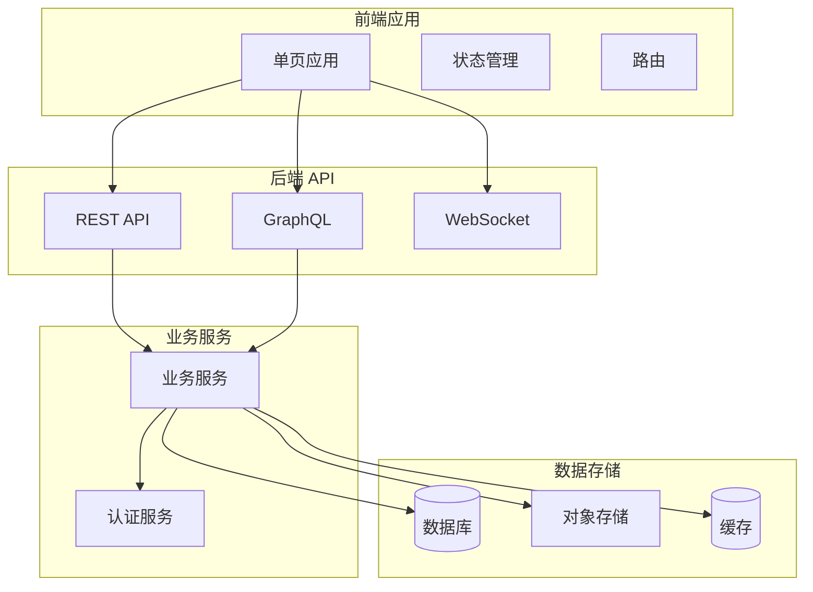

### 事件驱动架构

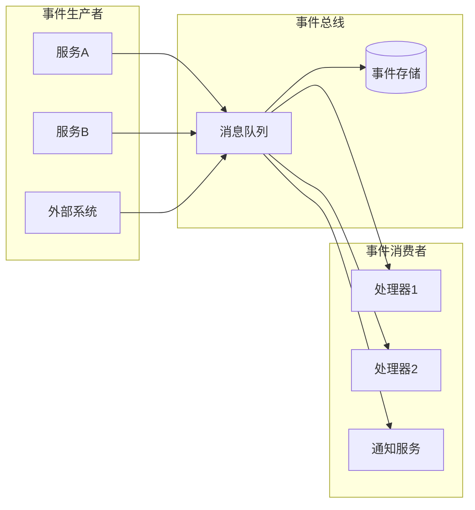

---

## 时序图模板

### 用户认证流程

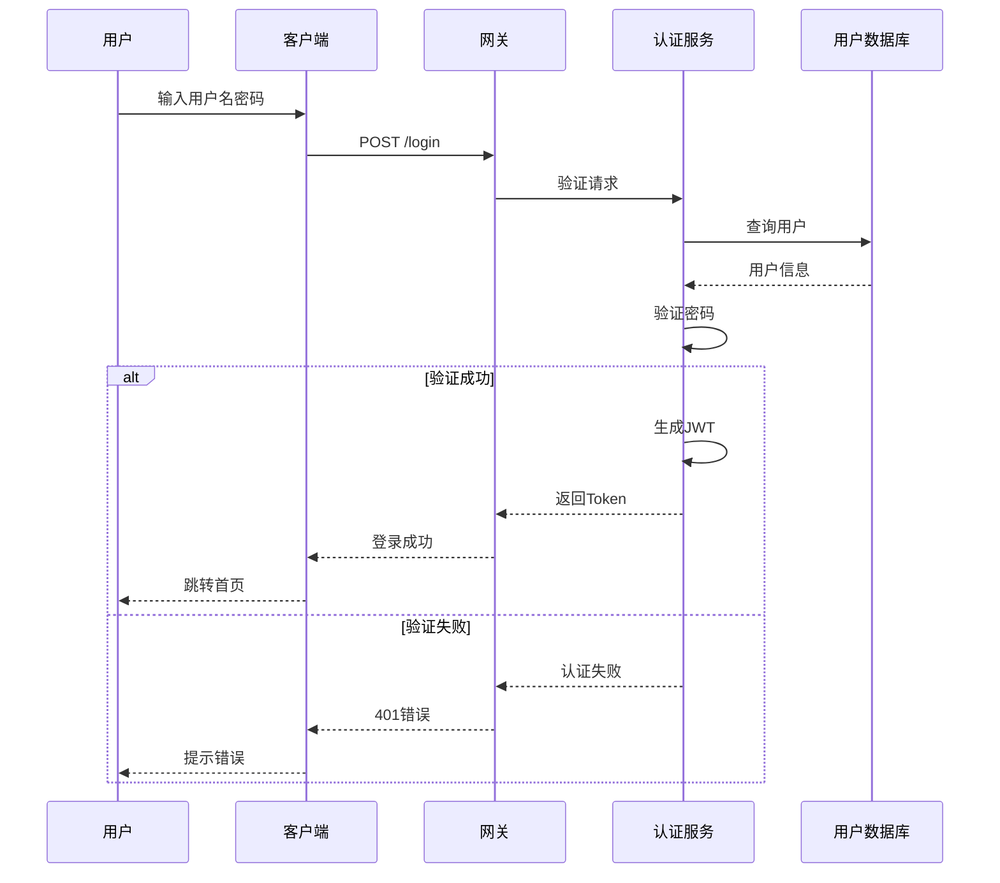

### CRUD 操作流程

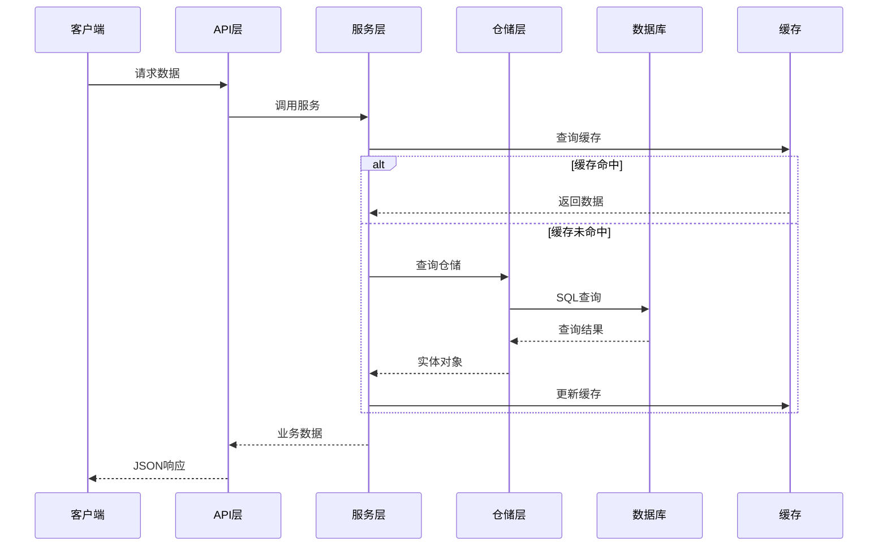

### 异步处理流程

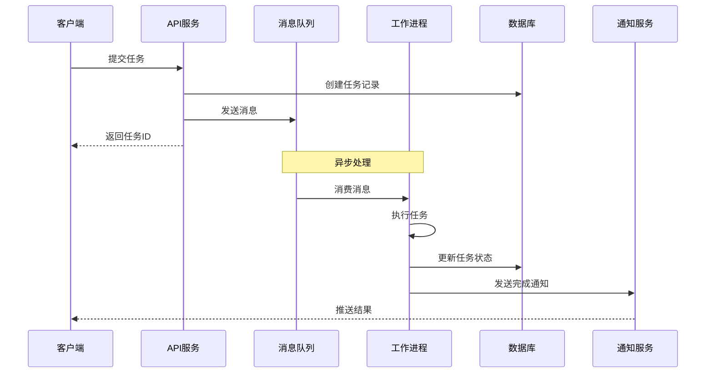

---

## 数据流图模板

### 请求处理数据流

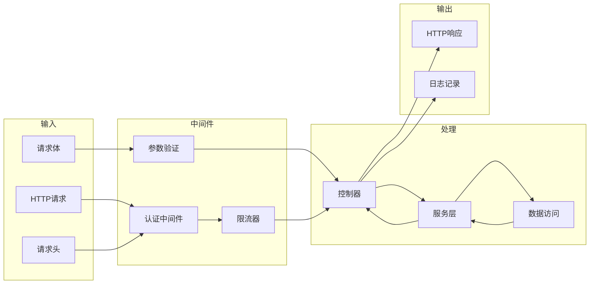

### ETL 数据流

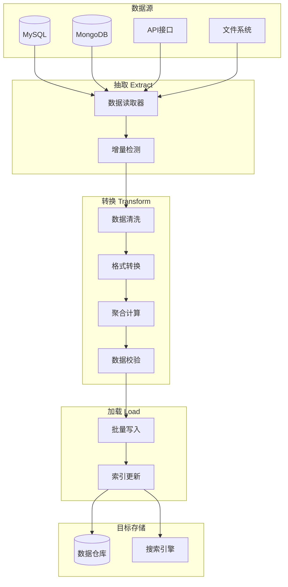

### 状态机数据流

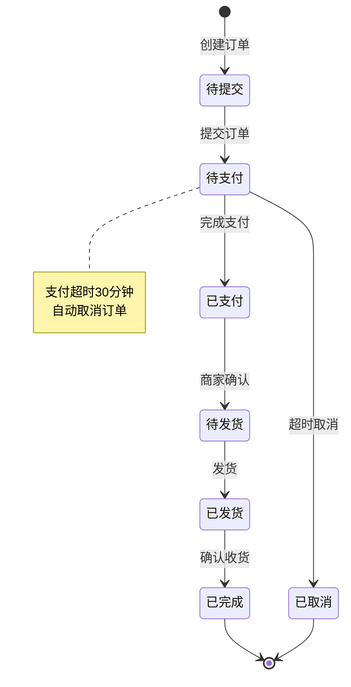

---

## 类图模板

### 领域模型类图

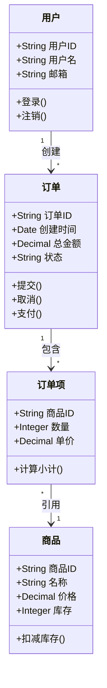

### 设计模式类图

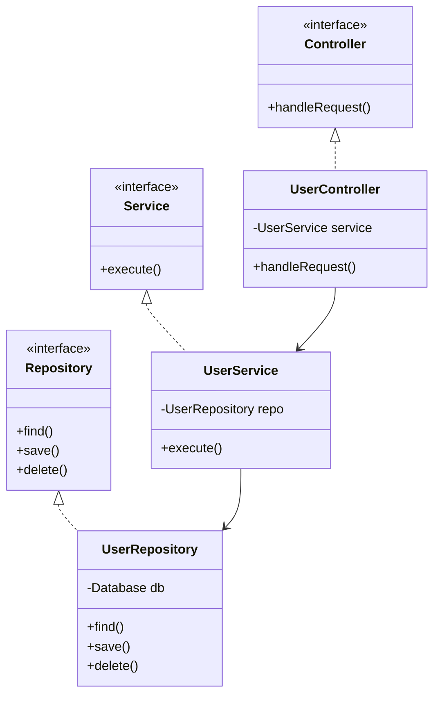
