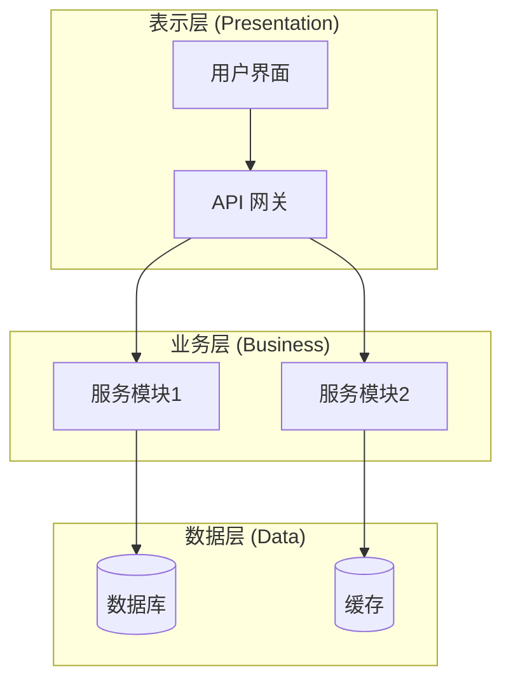

# 模式一：系统架构分析

从宏观层面分析项目，识别系统边界、模块关系、外部依赖和潜在性能风险。

## 分析步骤

### 1. 明确分析目标与执行模式
- 确认当前分析主题是否为 `architecture`
- 明确分析范围：全项目 / 模块级
- 确认当前执行模式：`new-doc` / `update-doc`
- 明确目标模块、关键入口点、重点关注的依赖或风险链路

### 2. 优先检查相关 docs
- 优先读取 `docs/OVERVIEW.md`
- 优先读取相关 `docs/feature-*.md`
- 优先读取相关 `docs/reference-*.md`
- 如调用方已提供候选文档路径，优先复用这些文档

这些文档只能作为**半可信上下文**：
- 可用于快速建立模块心智模型
- 但必须继续以当前代码核实
- 文档与代码冲突时，以代码为准

如 `docs/` 中存在旧式分析文档、frontmatter 元数据或需要补充检索，可选使用 metadata 扫描脚本辅助检查；不要把它当成主入口。

### 3. 拆分并行子任务

建议优先拆成以下 3 个并行子任务：
- **子任务 A：技术栈与入口点**
  - 识别运行时、框架、构建工具、主入口文件、关键配置文件
- **子任务 B：目录结构与模块边界**
  - 扫描主要目录，梳理模块职责、分层边界、核心目录
- **子任务 C：依赖关系、外部服务与风险点**
  - 识别模块间依赖、数据库、缓存、队列、第三方服务与潜在性能放大点

如项目较小，可合并为 2 个子任务；如项目较复杂，可扩展到 4 个，但应保持任务独立。

### 4. 分析目录结构与关键模块
- 使用 Glob 扫描主要目录
- 识别分层模式：controllers、services、models、utils 等
- 标注入口文件和关键配置文件
- 提取核心模块、模块边界、关键依赖与外部系统

### 5. 生成架构图与结构化结论

**输出格式（Mermaid 架构图）：**

每张 Mermaid 图后都必须紧跟一张语义一致的 ASCII/TUI 预览图。

## 架构图模板选择

- **分层架构**：适用于传统 MVC、三层架构项目
- **微服务架构**：适用于多服务、分布式系统
- **前后端分离**：适用于 SPA + API 项目
- **单体应用**：适用于小型项目

> 详细模板参考 `references/mermaid-templates.md` 中的架构图模板部分。

## SubAgent 执行要求

下发并行子任务时，要求每个 subagent 返回结构化结果，至少包括：
- 分析范围
- 关键文件路径
- 发现的模块 / 服务 / 入口点
- 依赖关系或外部服务
- 风险点或需要主 agent 复核的疑点

subagent 只负责读代码和整理事实，不负责写最终文档。

## 执行指南

1. 明确架构分析目标、范围与执行模式
2. 优先检查 `docs/OVERVIEW.md`、相关 `feature-*`、相关 `reference-*`
3. 如需要补充文档检索，再可选使用 metadata 扫描脚本
4. 使用 Agent 工具将系统架构分析拆成 2-4 个只读子任务并行执行
5. 汇总技术栈、目录结构、模块边界、依赖关系、外部服务与风险点
6. 综合分析后生成 Mermaid 架构图
7. 立即为该 Mermaid 架构图补充等价的 ASCII/TUI 预览图
8. 产出结构化结论与可回填的 section 草稿
9. 将结果整理进目标文档：已有合适承接文档则 `update-doc`，否则 `new-doc`
10. 优先更新 `feature-*` / `reference-*` / `OVERVIEW.md`
11. 若没有合适长期文档承接，再创建新的分析文档
