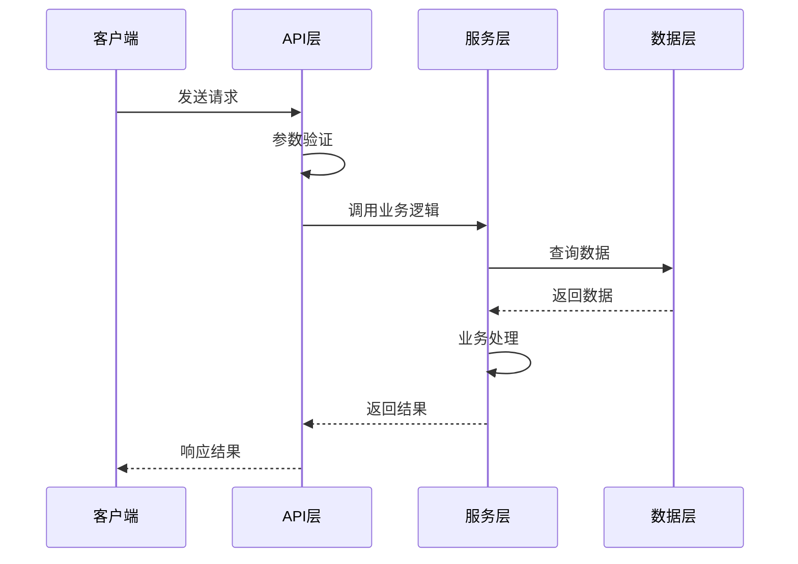
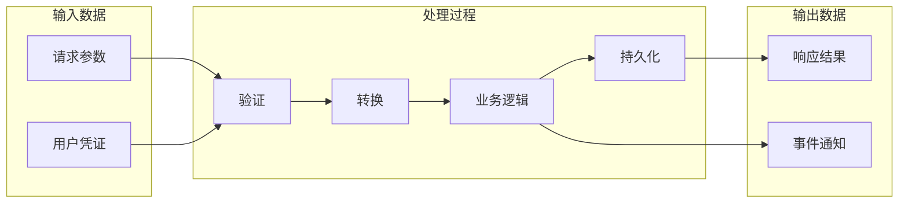

# 模式二：模块数据流分析

深入分析特定模块或功能的数据流转过程、关键调用链、时序关系与潜在风险点。

## 分析步骤

### 1. 明确分析目标与执行模式
- 确认当前分析主题是 `dataflow` / `sequence`，或以流程链路为主的 `performance-risk`
- 明确要分析的功能或模块
- 识别入口点（API 端点、事件处理器、命令入口）
- 确认当前执行模式：`new-doc` / `update-doc`

### 2. 优先检查相关 docs
- 优先读取 `docs/OVERVIEW.md`
- 优先读取相关 `docs/feature-*.md`
- 优先读取相关 `docs/reference-*.md`
- 如调用方已提供候选文档路径，优先复用这些文档

这些文档只能作为**半可信上下文**：
- 可用于快速建立模块心智模型
- 但必须继续以当前代码核实
- 文档与代码冲突时，以代码为准

如 `docs/` 中存在旧式分析文档、frontmatter 元数据或需要做补充检索，可选使用 metadata 扫描脚本辅助检查；不要把它当成主入口。

### 3. 拆分并行子任务

建议优先拆成以下 3 个并行子任务：
- **子任务 A：入口点与边界定位**
  - 找到入口文件、入口函数、请求/事件来源、主要边界条件
- **子任务 B：调用链与关键处理节点**
  - 追踪从入口到核心业务逻辑的调用链，记录关键函数与跨层跳转
- **子任务 C：数据模型、外部 I/O 与风险点**
  - 提取输入结构、输出结构、持久化、缓存、消息、第三方 API 交互与潜在放大点

如流程非常短，可合并为 2 个子任务；如链路特别复杂，可加一个“异常/分支流程”子任务。

### 4. 追踪调用链与数据变换
- 从入口点开始追踪函数调用
- 记录数据在各层之间的转换
- 标注关键的数据处理节点
- 记录异常路径、分支路径或可能的性能放大点

### 5. 识别关键数据模型与外部 I/O
- 分析输入数据结构
- 追踪数据变换过程
- 记录输出数据结构
- 标注数据库、缓存、消息、第三方服务等外部交互

### 6. 生成时序图和数据流图

**时序图输出格式（Mermaid Sequence Diagram）：**

**数据流图输出格式（Mermaid Flowchart）：**

每张 Mermaid 图后都必须紧跟一张语义一致的 ASCII/TUI 预览图。

> 详细模板参考 `references/mermaid-templates.md` 中的时序图和数据流图模板部分。

## SubAgent 执行要求

下发并行子任务时，要求每个 subagent 返回结构化结果，至少包括：
- 入口点与触发方式
- 关键调用链（按顺序列出）
- 关键数据结构 / 参数 / 返回值
- 外部 I/O（数据库、缓存、消息、第三方服务）
- 风险点、异常路径或需要主 agent 复核的疑点

subagent 只负责事实提取与链路梳理，不直接写最终文档。

## 执行指南

1. 明确分析目标、入口点与执行模式
2. 优先检查 `docs/OVERVIEW.md`、相关 `feature-*`、相关 `reference-*`
3. 如需要补充文档检索，再可选使用 metadata 扫描脚本
4. 使用 Agent 工具将数据流 / 时序分析拆成 2-4 个只读子任务并行执行
5. 汇总入口点、调用链、数据结构、外部 I/O、异常路径与关键风险点
6. 生成时序图和数据流图
7. 为每张 Mermaid 图补充对应的 ASCII/TUI 预览图
8. 产出结构化结论与可回填的 section 草稿
9. 优先判断是否能更新到 `feature-*` / `reference-*` / `OVERVIEW.md`
10. 能承接则执行 `update-doc`，不能承接则执行 `new-doc`
11. 若明确需要独立成文或没有合适长期文档，再创建 `dataflow-*` / `sequence-*` 等新文档
